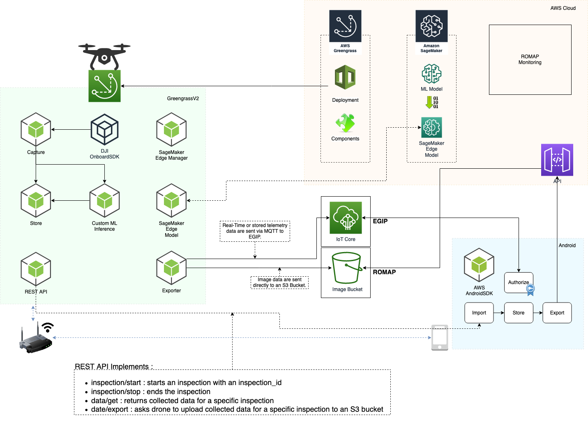

# Industry kit for Remote Inspection (of Solar Farms)

The objective for this repo is to provide a set of assets to address remote inspection (using drones and Computervision based AI/ML) of solar power generation plants. The pillar of this solution is the adoption of Greengrass v2 as runtime for edge device which could be a Jetson Nano, or an AWS EC2 instance for quick demo purposes. In real life scenarios GG will run on Jetson nano or GG compatible microcontroller HW attached to drone on-board computer. AI/ML model runs in realtime on the edge device using SageMaker Edge Manager to manage lifecycle of the model. The model was training with a small dataset of thermal images captured during a drone flight over a solar power plants. It's important to stress the objective is not to provide an enterprise grade ML model (this is due mainly to availabilityof small dataset) but to show and end-to-end management platform. GreenGrass v2.5 is supported on many Linux flavours, Windows and on different hw architectures (x86, AMD, ARM) and so can be used to have an homogeneous solution for a variety of robots and drone of many vendors.
This use case is related to Solar plants but using different model (trained with different dataset) could be adapted to other use cases like rust detection on wind blades.

## Photovoltaic panels "hotspot" anomalies

Hotspots: (ref: http://en.radmanenergy.ir/343/hot-spots/ )
These are regions on the solar panel that are overloaded, due to which they become warm. These can be generated because of poorly soldered cell connections or even structural flaws in solar cells. Inadequate soldered connections decrease the resistance in segments that receive the power rendered by cells. This resistance leads to an increased voltage, forming a hotspot in the soldered cell. Hotspots can result in short-circuits and can also depreciate the productivity and goodwill of the PV system

Here below an example of hotspots in ous sample dataset

## Architecture

## Components

### REST API

REST API component is responsible of providing a REST interface for accessing the drone locally. It implements following APIs :

- /inspection/start?inspection_id={id} : starts an inspection with the given inspection id. The Store component records the data into the corresponding inspection_id folder.
- /inspection/stop : stops the inspection. Inspection id is set to no_id, therefore, the inspection data is not stored anymore.
- /data/get?inspection_id={id} : returns json formatted data for the given inspection_id.
- /data/export?inspection_id={id} : compresses the folder where inspection data is stored and puts it into an S3 bucket.
- /publishTest : publishes a test data. The published data is stored into inspection_id folder if an inspection has been started before.
- /publishImageTest : publishes an image test data. Path to a sample image is sent to Machine Learning Inference component and the result of it stored in the inspection_id folder if an inspection has been started before.

#### Security of the endpoint

This local API is accessible by any device in the same network. Therefore, in the production it needs to be secured. The endpoint is run by using gunicorn. The best way would be to use two-way TLS where both server and client verifies each other's certificates. The REST API is run in Greengrass. The local Greengrass IoT Thing certificate can be used for server side certificate purposes. The client will be the mobile application. Therefore, in the current implementation of the mobile app that has been developed by Reply, an IoT certificate is used. This certificate can be used for client side certificate.

##### Two-way-TLS authentication sample

The following command can be used to initate a gunicorn server which uses two way TLS authentication :

`gunicorn -w 4 -k uvicorn.workers.UvicornWorker --log-level warning --cert-reqs 1 --keyfile domain.key --certfile domain.crt --ca-certs twoway.crt example:app`

And the client can authenticate to the server by using client side certificates :

`curl -vk --key twoway.key --cert twoway.crt https://127.0.0.1:8000`

The security can be improved further by checking the Certificate Authority that has signed the certificates.

### DJI Onboard SDK

DJI Onboard SDK component is responsible for retrieving DJI Telemetry and Image data by using DJI Onboard SDK (OSDK). It has been developed in C++ due to DJI OSDK is only available in C++. Currently, this component can be used only for retrieving telemetry data, since image capture API is only available for DJI Matrice 300 series drones.

### Capture

Capture component recieves the drone data from DJI Onboard SDK component and formats it. It sends the formatted data to the Store component. If it is related to image and machine learning operations, it sends the data to ML Inference component as well.

### Store

Store component is responsible for storing the received data in the corresponding inspection folders locally. It implements aggregation of the data by time. When there is new data, it is aggregated and saved. The inspection folder name is defined by inspection id. Inspection id is set by the REST API component when /inspection/start?inspection_id={id} API is called.

### Exporter

Exporter component receives export data command from the REST API /data/export?inspection_id={id} API. When it receives an export command it compresses the inspection id folder and transfers it to an S3 Bucket.

### ML Inference

Machine Learning Inference component receives images from Capture component and runs a custom ML model for these images. The ML inference result is sent to Store component for storing the data in the current inspection.

### Custom ML

This component is used in the case where Greengrass runs in a computer. It watches "/home/ggc_user/djiimages" folder for changes. When there is a new file in this folder, Machine Learning Inference runs for this image.

### FlightRecord

DJI has a propriety format which is called as FlightRecord file. This component is used in the case where Greengrass runs in a computer. It watches "/home/ggc_user/flightdata" folder for changes. When there is a new flight record file in this folder, it is parsed to retrieve telemetry and image data. This component is running a nodejs script that is developed for this purpose. The recipe installs a public repository to the device for parsing the DJI's flight record files.

## How to run the components

In order to test the components, greengrass-cli needs to be installed with AWS Greengrass. Please see : https://docs.aws.amazon.com/greengrass/v2/developerguide/install-gg-cli.html

For each component that needs to be installed, enter to the folder of the component and run the following command :

`sudo /greengrass/v2/bin/greengrass-cli deployment create --recipeDir recipes --artifactDir artifacts --merge "com.example.HelloWorld=1.0.0"`

You need to change com.example.HelloWorld=1.0.0 with the component name and version. The name and version of the component must match the name recipe file under recipes folder of the component. Please see : https://docs.aws.amazon.com/greengrass/v2/developerguide/create-components.html

## SageMaker Edge Manager

SageMaker Neo is a platform which allows Machine Learning developers to compile and run their models in the cloud and at the edge. By using SageMaker Neo, a model can be optimized and compiled for different device types. The model does not have to be trained by Amazon SageMaker to be compiled by Neo. Please see : https://docs.aws.amazon.com/sagemaker/latest/dg/neo.html

SageMaker Edge Manager is a tool that facilitates the model management at the edge by using SageMaker Neo optimized models. SageMaker Edge Manager Agent runs on the edge device to perform operations to secure, optimize and maintain the machine learning inference. Therefore, it simplifies the management of the fleets that uses different device architecture. Please see : https://docs.aws.amazon.com/sagemaker/latest/dg/edge.html

### Greengrass

Greengrass provides a SageMaker Edge Manager component. During the prototyping, a sample Greengrass inference has been created. It can be found under SageMakerEdgeManager folder. Please see the [README.md](SageMakerEdgeManager/Greengrass/README.md) file under this folder for the instructions.

Docs : https://docs.aws.amazon.com/sagemaker/latest/dg/edge-greengrass.html

### Linux and Windows as stand-alone agent

It is also possible to use stand-alone SageMaker Agent without Greengrass for Windows and Linux devices.

Docs : https://docs.aws.amazon.com/sagemaker/latest/dg/edge-device-fleet-manual.html
