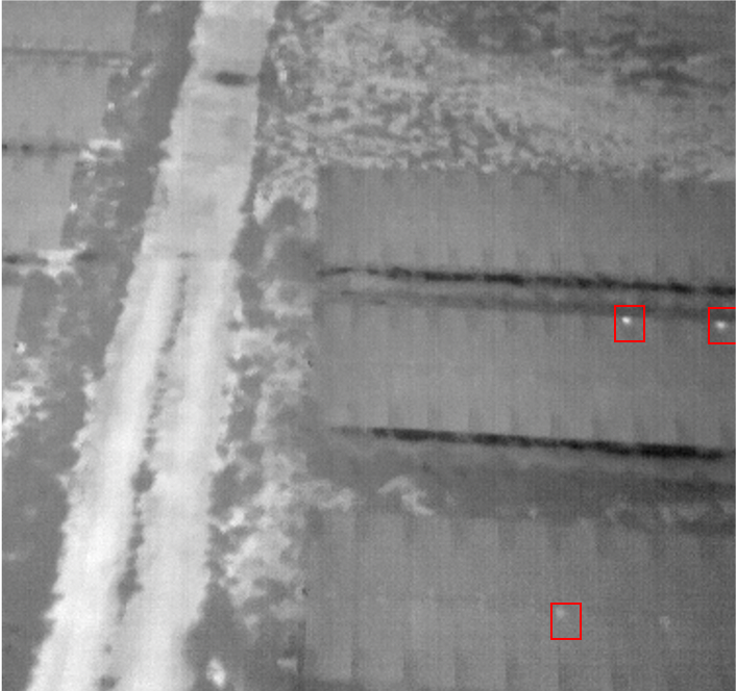
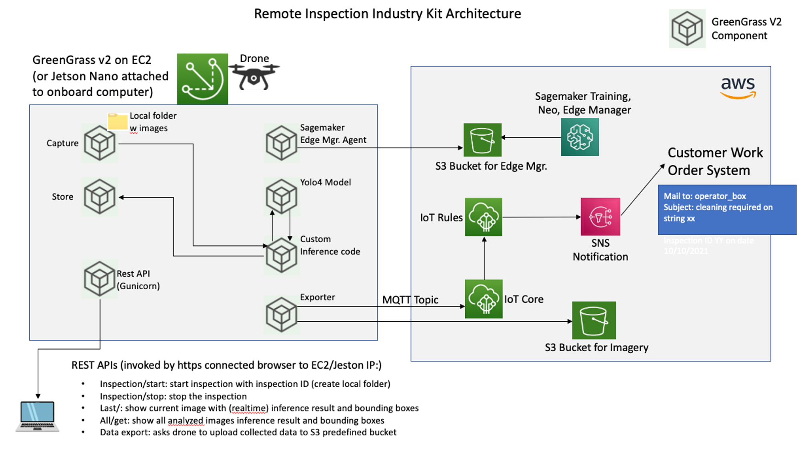
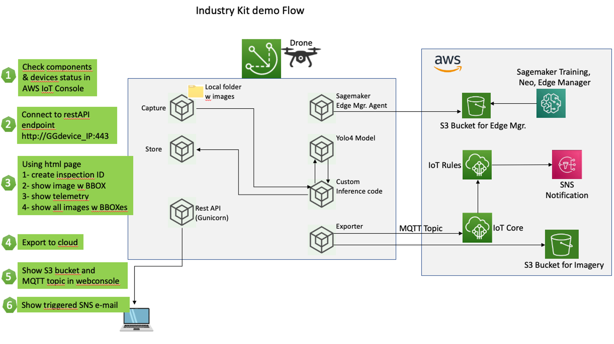

# Industry kit for Remote Inspection with computer vision at edge (of solar farms)

The objective for this repo is to provide a set of assets to address remote inspection (using drones and Computervision based AI/ML) of solar power generation plants. The pillar of this solution is the adoption of Greengrass v2 as runtime for edge device which could be a Jetson Nano, or an AWS EC2 instance for quick demo purposes. In real life scenarios GG will run on a Jetson nano or GG compatible microcontroller HW attached to drone on-board computer. AI/ML model runs in realtime on the edge device using SageMaker Edge Manager to manage lifecycle of the model. The model was trained with a small dataset of thermal images captured during a drone flight. It's important to stress that the objective is not to provide an enterprise grade ML model (due to to a limited dataset of 42 images) but to show and end-to-end management platform. GreenGrass v2.5 is supported on many Linux flavours, Windows and on different hw architectures (x86, AMD, ARM) and so can be used to have an homogeneous solution for a variety of robots and drone of many vendors.

This use case is related to Solar plants but using different model (trained with different dataset) could be adapted to other use cases like rust detection on wind blades.

## Photovoltaic panels "hotspot" anomalies

Hotspots: (ref: http://en.radmanenergy.ir/343/hot-spots/ )
These are regions on the solar panel that are overloaded, due to which they become warm. These can be generated because of poorly soldered cell connections or even structural flaws in solar cells. Inadequate soldered connections decrease the resistance in segments that receive the power rendered by cells. This resistance leads to an increased voltage, forming a hotspot in the soldered cell. Hotspots can result in short-circuits and can also depreciate the productivity and goodwill of the PV system

Here below an example of hotspots in our sample dataset (red bounding boxes)

## Architecture

## Components provided

With AWS IoT Greengrass, Version 2, you can arbitrarily develop and deploy modular software in units called components. Each custom component require at least a recipe (a YAML or JSON document) to describe start/stop procedure and potential dependecies on other components and a folder with artifact, where code is stored. In the folder named "components" you will find all the custom components required including the machine learning model (trained with the sample dataset) and the inference code. These component could be created and deployed in AWS IoT using the create_components python script.

## Installation steps

### Requirements:

You need to install few AWS components in your local workstation/PC: 

AWS CLI 2.2.30
AWS Session Manager plugin for AWS CLI
AWS CDK 2.15.0

ref: https://docs.aws.amazon.com/cli/latest/userguide/getting-started-install.html
ref: https://docs.aws.amazon.com/systems-manager/latest/userguide/session-manager-working-with-install-plugin.html
ref: https://docs.aws.amazon.com/cdk/v2/guide/getting_started.html

Configure your local AWS credentials and default region with AWS CONFIGURE command

Other opensource tools which needs to be installed:
nodejs v17.7.1
typescript 4.6.3
git 2.33

### clone github repo and launch CDK Deploy

Clone gitlab repo in your local directory (here I used "ikit" as a reference)
git clone https://gitlab.aws.dev/-/ide/project/industry-kits/powerandutilities ./ikit

cd ikit/source/CDK
npm install (this is to be sure to have same CDK libraries as listed in package.json)
cdk deploy

CDK will prompt "(NOTE: There may be security-related changes not in this list. See https://github.com/aws/aws-cdk/issues/1299)
Do you wish to deploy these changes (y/n)? y
type "y" and enter.
Deployment should take about 5 minutes.

CDK will deploy all stack including GGv2 and related core devices, components and deployments.
Take note of EC2 instance-id from CDK/CloudFormation output

### establish a port forwarding to acceess mokup of mobile app

Gunicorn webserver is running on EC2/GGv2 and we need to establish a port-forward from instance 80 port to local 9000 of our workstation.
Use ssm plugin. Replace "i-05f4123e926d3acae" with your instance id

aws ssm start-session --target i-05f4123e926d3acae --document-name AWS-StartPortForwardingSession --parameters '{"portNumber":["80"],"localPortNumber":["9999"]}'

Test your browser with localhost:9000 If you see {"hello":"world"} you successfully got an answer from gunicorn on EC2.
If this fails please check browser security settings to assure http traffic is allowed.

Open you browser with the simulated mobile application link: ikit/source/static/index.html
You are ready to go.

## Demo instructions
Insert name of this inspection in first box.
When you press the green bottom a local folder on GGv2 will be created to store all images.
Gray button shows current frame with bounding box on detected anomalies.
Blue button shows all frames from start of inspection in a single page.
Export will upload images and telemetry data to S3 bucket.
Once done, stop with red button.

## Clean up instructions

Go in you local repo and launch CDK destroy.
cd ikit/source/CDK
cdk destroy

This would cleanup everything except for Greengrass stuff like core devices, components, deployments.
You could delete this using AWS console or AWS CLI.
Here below some examples with CLI.

aws iot delete-thing-group --thing-group-name ri-drone-mock-group

aws iot list-thing-principals --thing-name ri-drone-mock  

TAKE NOTE OF CERTIFICATES

aws iot detach-thing-principal --thing-name ri-drone-mock --principal arn:aws:iot:eu-central-1XXXXXXX

aws iot delete-thing --thing-name ri-drone-mock  

aws greengrassv2 delete-core-device --core-device-thing-name ri-drone-mock

aws greengrassv2 list-components

aws greengrassv2 delete-component --arn XXXXXX

Aws Greengrassv2 list-deployments

LOOK FOR targetArn arn:aws:iot:eu-central-1:YOUR_ACCOUNT_NUMBER:thinggroup/ri-drone-mock-group and TAKE NODE of deployment id

aws greengrassv2 cancel-deployment --deployment-id YOUR_DEPLLOYMENT_ID

## Green Grass v2 Custom Components

### REST API

REST API component is responsible of providing a REST interface for accessing the drone locally. It implements following APIs :

- /inspection/start?inspection_id={id} : starts an inspection with the given inspection id. The Store component records the data into the corresponding inspection_id folder.
- /inspection/stop : stops the inspection. Inspection id is set to no_id, therefore, the inspection data is not stored anymore.
- /data/get?inspection_id={id} : returns json formatted data for the given inspection_id.
- /data/export?inspection_id={id} : compresses the folder where inspection data is stored and puts it into an S3 bucket.
- /publishTest : publishes a test data. The published data is stored into inspection_id folder if an inspection has been started before.
- /publishImageTest : publishes an image test data. Path to a sample image is sent to Machine Learning Inference component and the result of it stored in the inspection_id folder if an inspection has been started before.

### DJI Onboard SDK

DJI Onboard SDK component is responsible for retrieving DJI Telemetry and Image data by using DJI Onboard SDK (OSDK). It has been developed in C++ due to DJI OSDK is only available in C++. Currently, this component can be used only for retrieving telemetry data, since image capture API is only available for DJI Matrice 300 series drones.

### Capture

Capture component recieves the drone data from DJI Onboard SDK component and formats it. It sends the formatted data to the Store component. If it is related to image and machine learning operations, it sends the data to ML Inference component as well.

### Store

Store component is responsible for storing the received data in the corresponding inspection folders locally. It implements aggregation of the data by time. When there is new data, it is aggregated and saved. The inspection folder name is defined by inspection id. Inspection id is set by the REST API component when /inspection/start?inspection_id={id} API is called.

### Exporter

Exporter component receives export data command from the REST API /data/export?inspection_id={id} API. When it receives an export command it compresses the inspection id folder and transfers it to an S3 Bucket.

### ML Inference

Machine Learning Inference component receives images from Capture component and runs a custom ML model for these images. The ML inference result is sent to Store component for storing the data in the current inspection.

### IKIT_YOLO4

This is an object detection model based in Yolo4 and trained with the thermal images dataset.

### FlightRecord

DJI has a propriety format which is called as FlightRecord file. This component is used in the case where Greengrass runs in a computer. It watches "/home/ggc_user/flightdata" folder for changes. When there is a new flight record file in this folder, it is parsed to retrieve telemetry and image data. This component is running a nodejs script that is developed for this purpose. The recipe installs a public repository to the device for parsing the DJI's flight record files.

## How to run the components

In order to test the components, greengrass-cli needs to be installed with AWS Greengrass. Please see : https://docs.aws.amazon.com/greengrass/v2/developerguide/install-gg-cli.html

For each component that needs to be installed, enter to the folder of the component and run the following command :

`sudo /greengrass/v2/bin/greengrass-cli deployment create --recipeDir recipes --artifactDir artifacts --merge "com.example.HelloWorld=1.0.0"`

You need to change com.example.HelloWorld=1.0.0 with the component name and version. The name and version of the component must match the name recipe file under recipes folder of the component. Please see : https://docs.aws.amazon.com/greengrass/v2/developerguide/create-components.html

## SageMaker Edge Manager

SageMaker Neo is a platform which allows Machine Learning developers to compile and run their models in the cloud and at the edge. By using SageMaker Neo, a model can be optimized and compiled for different device types. The model does not have to be trained by Amazon SageMaker to be compiled by Neo. Please see : https://docs.aws.amazon.com/sagemaker/latest/dg/neo.html

SageMaker Edge Manager is a tool that facilitates the model management at the edge by using SageMaker Neo optimized models. SageMaker Edge Manager Agent runs on the edge device to perform operations to secure, optimize and maintain the machine learning inference. Therefore, it simplifies the management of the fleets that uses different device architecture. Please see : https://docs.aws.amazon.com/sagemaker/latest/dg/edge.html

### Linux and Windows as stand-alone agent

It is also possible to use stand-alone SageMaker Agent without Greengrass for Windows and Linux devices.

Docs : https://docs.aws.amazon.com/sagemaker/latest/dg/edge-device-fleet-manual.html

## Demo Flow (step by step)

